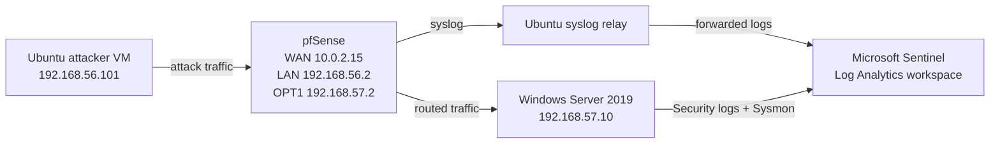
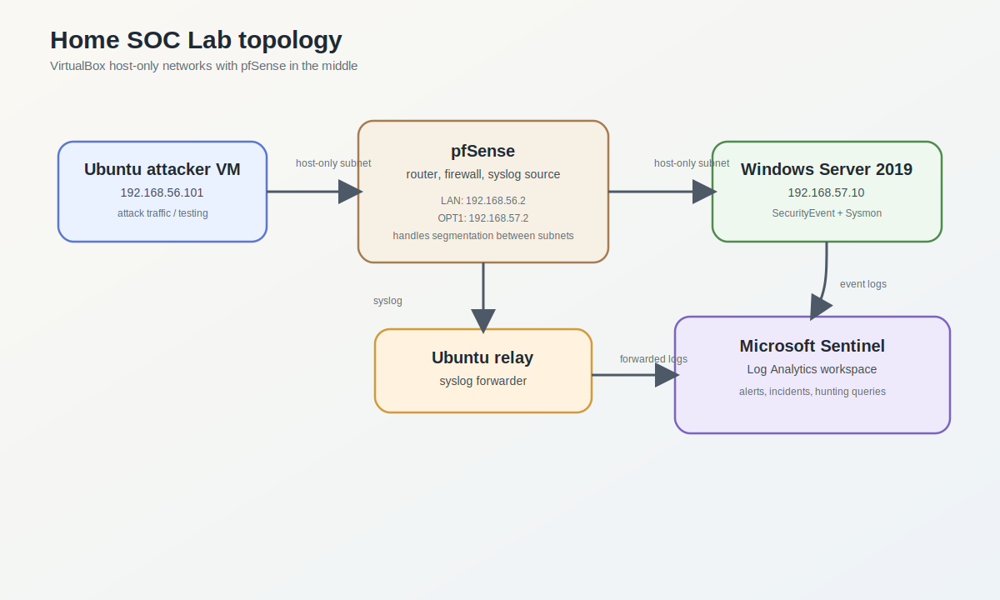
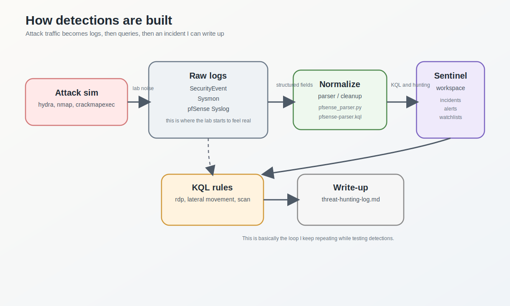

# Home SOC Lab

This home SOC lab runs in VirtualBox on a local Windows host. The core build is done: Windows, pfSense, Ubuntu, Sentinel, and the main detections all work. A couple cleanup items stay deferred.

---

## Lab topology



The Ubuntu attacker VM sits on the `192.168.56.0/24` side and the Windows VM sits on the `192.168.57.0/24` side. pfSense is the middle box, so I can test firewall rules, watch blocked traffic, and compare what the network sees versus what Sentinel sees.

---

## Visuals

These are just hand-made SVGs so the repo is easier to skim.





---

## What is in the lab

| Machine | OS | Role |
|---|---|---|
| firewall | pfSense 2.7 | network segmentation, traffic filtering, syslog source |
| attacker | Ubuntu attacker VM | red team / attack simulation |
| victim | Windows Server 2019 | target, log source |
| SIEM | Microsoft Sentinel (Azure) | log ingestion, detection, alerting |

---

## Repo layout

| File | What it is |
|---|---|
| `rdp-brute-force.kql` | RDP brute force detection |
| `lateral-movement.kql` | Failed-then-successful logon correlation |
| `port-scan.kql` | Port scan detection from pfSense logs |
| `pfsense-parser.kql` | Sentinel parser function for pfSense filterlog |
| `ioc-watchlist-hunt.kql` | IOC hunting queries against the watchlist |
| `phishing-macro-chain.kql` | Office child-process detection for a phishing / macro chain |
| `reverse-shell.kql` | Suspicious outbound callback detection from shell-like processes |
| `attack-chain-walkthrough.md` | Short end-to-end writeup for the lab attack chain |
| `results.md` | Real lab results and what actually fired |
| `evidence/live-sentinel-results.md` | Current live Sentinel replay proof |
| `evidence/current-sentinel-verification.md` | Archived empty-workspace Sentinel check note |
| `evidence/README.md` | Short index of the most useful evidence files |
| `work-in-progress.md` | Project status and final notes |
| `ioc-watchlist.csv` | Sample watchlist data |
| `sentinel_report.py` | Python script that pulls Sentinel incidents through the Azure API |
| `pfsense_parser.py` | Local parser for raw pfSense filterlog entries |
| `setup-guide.md` | Step-by-step build notes |
| `threat-hunting-log.md` | Running notes from each testing session |

---

## Log sources connected to Sentinel

- Windows Security Event logs
- Sysmon on the Windows box
- pfSense syslog forwarded through a small relay VM

Sysmon config: [SwiftOnSecurity sysmon config](https://github.com/SwiftOnSecurity/sysmon-config)

---

## Current status

The short version is in [work-in-progress.md](work-in-progress.md).

| Status | What I finished or hit |
|---|---|
| Done | Base lab setup and log collection |
| Done | RDP brute force, lateral movement, port scan, and IOC hunting |
| Done | Live Windows Security replay and pfSense block replay |
| Done | Current live Sentinel replay | `HomeLabSecurity_CL`, `HomeLabNetwork_CL`, and `HomeLabSysmon_CL` all return real rows |
| Done | LibreOffice macro chain replay | `soffice.bin` spawned `cmd.exe` |
| Done | Reverse-shell style callback | Hidden PowerShell connected back to the host listener |
| Deferred | Move the Windows collector from MMA to AMA | Cleanup task |
| Deferred | Basic Sentinel playbook automation | Needs a working alert pipeline |

---

## Results so far

The tests I actually ran are in [results.md](results.md).

| Date | Test | Result |
|---|---|---|
| Jan 25 2026 | RDP brute force | `rdp-brute-force.kql` fired after 10 failures |
| Feb 3 2026 | Lateral movement | Rule fired on the IP + username pair |
| Feb 10 2026 | Port scan | `port-scan.kql` detected 200+ ports in 2 minutes |
| Mar 29 2026 | LibreOffice macro replay | `phishing-macro-chain.kql` matched the AttackLab macro chain |
| Mar 29 2026 | Reverse-shell style callback | `reverse-shell.kql` matched the hidden PowerShell callback |
| Mar 31 2026 | Current Sentinel replay | `HomeLabSecurity_CL`, `HomeLabNetwork_CL`, and `HomeLabSysmon_CL` all returned real rows |

The current Sentinel proof is in [evidence/live-sentinel-results.md](evidence/live-sentinel-results.md).
The older empty-workspace check stays archived in [evidence/current-sentinel-verification.md](evidence/current-sentinel-verification.md).
The Mar 29 local replay is in [evidence/live-completion.md](evidence/live-completion.md).
The pfSense replay is in [evidence/pfSense-port-scan-replay.md](evidence/pfSense-port-scan-replay.md).
The screenshots are indexed in [evidence/README.md](evidence/README.md) and live under `evidence/screenshots/`.

---

## Attack scenarios I tested

### 1. RDP brute force
Used `hydra` from the Ubuntu attacker VM against RDP on the Windows box.

```bash
hydra -l administrator -P /usr/share/wordlists/rockyou.txt rdp://192.168.57.10 -t 4
```

The default Microsoft rule did not fire fast enough. I wrote my own rule in `rdp-brute-force.kql`.

### 2. SMB enumeration / lateral movement sim
Used `crackmapexec` to enumerate shares and test credentials.

```bash
crackmapexec smb 192.168.57.10 -u administrator -p Password123 --shares
```

Event ID 4624 and 4776 showed up. The correlation rule is in `lateral-movement.kql`.

### 3. Nmap scan
Basic recon from the Ubuntu attacker VM.

```bash
nmap -sV -O 192.168.57.10
```

### 4. LibreOffice macro chain
Used the LibreOffice AttackLab macro on the Windows guest.

### 5. Reverse-shell style callback
Launched a hidden PowerShell callback from the Windows guest.

---

## Detection rules

All of the KQL files live in the repo root.

| Rule | What it detects |
|---|---|
| `rdp-brute-force.kql` | High volume of failed RDP logons from a single IP |
| `lateral-movement.kql` | Successful logon following multiple failures |
| `port-scan.kql` | Multiple connection attempts across ports in a short window |
| `phishing-macro-chain.kql` | Office apps spawning PowerShell, cmd, or script hosts |
| `reverse-shell.kql` | Shell-like processes making outbound connections |

---

## Notes / issues

- MMA setup was annoying until I fixed the key
- pfSense syslog needed a custom parser
- Sentinel free tier is limited to 10GB/day
- Custom KQL made the logs easier to understand

---

## Deferred work

- Velociraptor for endpoint forensics
- Sentinel playbooks / Logic Apps
- Move the Windows collector from MMA to AMA
- Add more evidence later if I need it

---

## Tools used

- VirtualBox 7.0
- pfSense 2.7
- Ubuntu attacker VM
- Windows Server 2019 (eval license)
- Microsoft Sentinel (Azure free tier)
- Sysmon + SwiftOnSecurity config
- Hydra, crackmapexec, nmap
